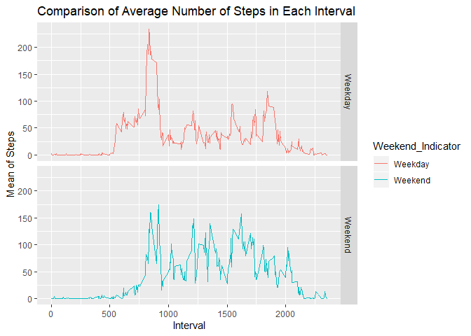

## Introduction

This assignment makes use of data from a activity monitoring device. The device collects data at 5 minute intervals through out the day.

## Dataset

The variables included in this dataset are:

* steps: Number of steps taking in a 5-minute interval (missing values are coded as NA)
* date: The date on which the measurement was taken in YYYY-MM-DD format
* interval: Identifier for the 5-minute interval in which measurement was taken

The dataset is stored in a comma-separated-value (CSV) file and there are a total of 17,568 observations in this dataset.

## Load required libraries used in the analysis


```r
rm(list = ls())
library(dplyr)
```

```
## 
## Attaching package: 'dplyr'
```

```
## The following objects are masked from 'package:stats':
## 
##     filter, lag
```

```
## The following objects are masked from 'package:base':
## 
##     intersect, setdiff, setequal, union
```

```r
library(ggplot2)
library(gridExtra)
```

```
## Warning: package 'gridExtra' was built under R version 3.6.2
```

```
## 
## Attaching package: 'gridExtra'
```

```
## The following object is masked from 'package:dplyr':
## 
##     combine
```

```r
library(lubridate)
```

```
## 
## Attaching package: 'lubridate'
```

```
## The following object is masked from 'package:base':
## 
##     date
```

## Load activity data


```r
data <- read.csv(file = "C:/Users/manol/Documents/GitHub/RepData_PeerAssessment1/activity.csv")
```

## Overview and summary of data

```r
head(data)
```

```
##   steps       date interval
## 1    NA 2012-10-01        0
## 2    NA 2012-10-01        5
## 3    NA 2012-10-01       10
## 4    NA 2012-10-01       15
## 5    NA 2012-10-01       20
## 6    NA 2012-10-01       25
```

```r
summary(data)
```

```
##      steps                date          interval     
##  Min.   :  0.00   2012-10-01:  288   Min.   :   0.0  
##  1st Qu.:  0.00   2012-10-02:  288   1st Qu.: 588.8  
##  Median :  0.00   2012-10-03:  288   Median :1177.5  
##  Mean   : 37.38   2012-10-04:  288   Mean   :1177.5  
##  3rd Qu.: 12.00   2012-10-05:  288   3rd Qu.:1766.2  
##  Max.   :806.00   2012-10-06:  288   Max.   :2355.0  
##  NA's   :2304     (Other)   :15840
```

## What is mean total number of steps taken per day?


```r
step_day <- aggregate(data$steps, by = list(Date = data$date),
                      FUN = sum)
step_day <- rename(step_day, Total_Steps = x)
head(step_day)
```

```
##         Date Total_Steps
## 1 2012-10-01          NA
## 2 2012-10-02         126
## 3 2012-10-03       11352
## 4 2012-10-04       12116
## 5 2012-10-05       13294
## 6 2012-10-06       15420
```

```r
hist_step_day <-
    ggplot(data = na.omit(step_day), aes(Total_Steps)) +
    geom_histogram(binwidth = 1000, colour = "white") +
    xlab("Total Steps Taken Each Day") +
    ylab("Count") +
    ggtitle("Histogram of the Total Steps Taken Each Day")
hist_step_day
```

<!-- -->

Mean of the total number of steps taken per day

```r
mean(step_day$Total_Steps, na.rm = TRUE)
```

```
## [1] 10766.19
```

Median of the total number of steps taken per day

```r
median(step_day$Total_Steps, na.rm = TRUE)
```

```
## [1] 10765
```

## What is the average daily activity pattern?


```r
min_interval_data <- data %>%
    select(interval, steps) %>%
    na.omit() %>%
    group_by(interval) %>%
    summarize(Total_Steps = mean(steps))

ggplot(min_interval_data,
       aes(x = interval,
           y = Total_Steps)) +
    
    geom_line() +
    xlab("Time Intervals (5 min)") +
    ylab("Total Number of Steps") +
    ggtitle("Average Number of Steps Taken in 5 Minute Intervals")
```

<!-- -->

Which 5 minute interval, on average across all days in the dataset, contains the maximum number of steps?

```r
min_interval_data[which.max(min_interval_data$Total_Steps), ]
```

```
## # A tibble: 1 x 2
##   interval Total_Steps
##      <int>       <dbl>
## 1      835        206.
```

## Imputing missing values

Total number of missing values in the dataset

```r
colSums(is.na(data))
```

```
##    steps     date interval 
##     2304        0        0
```

Replace the missing values with the mean

```r
rep_na_mean <- function(x)
    replace(x,
            is.na(x),
            mean(x, na.rm = TRUE))

mean_dat <- data %>%
    group_by(interval) %>%
    mutate(steps = rep_na_mean(steps))

head(mean_dat)
```

```
## # A tibble: 6 x 3
## # Groups:   interval [6]
##    steps date       interval
##    <dbl> <fct>         <int>
## 1 1.72   2012-10-01        0
## 2 0.340  2012-10-01        5
## 3 0.132  2012-10-01       10
## 4 0.151  2012-10-01       15
## 5 0.0755 2012-10-01       20
## 6 2.09   2012-10-01       25
```

```r
#Count NA
colSums(is.na(mean_dat))
```

```
##    steps     date interval 
##        0        0        0
```

Create a dataset without missing values and make a histogram of the total number of steps taken each day

```r
#Calulate total steps per day
step_day_rep_na <- aggregate(mean_dat$steps,
                             by = list(Date = mean_dat$date),
                             FUN = sum)

step_day_rep_na <- rename(step_day_rep_na,
                          Total_Steps = x)
head(step_day_rep_na)
```

```
##         Date Total_Steps
## 1 2012-10-01    10766.19
## 2 2012-10-02      126.00
## 3 2012-10-03    11352.00
## 4 2012-10-04    12116.00
## 5 2012-10-05    13294.00
## 6 2012-10-06    15420.00
```

```r
#Plot histogram of new data
hist_na_rm <- ggplot(data = step_day_rep_na, aes(Total_Steps)) +
    geom_histogram(binwidth = 1000, colour = "white") +
    xlab("Total Steps Taken Each Day") +
    ylab("Count") +
    ggtitle("Histogram of the Total Steps Taken Each Day (NA Removed)")

hist_na_rm
```

<!-- -->

Mean of the total number of steps taken per day

```r
mean(step_day_rep_na$Total_Steps)
```

```
## [1] 10766.19
```

Median of the total number of steps taken per day

```r
median(step_day_rep_na$Total_Steps)
```

```
## [1] 10766.19
```

## Impact of imputing missing data


```r
#Histogram plots of total steps a day.
grid.arrange(hist_step_day, hist_na_rm, ncol = 2)
```

<!-- -->


```r
#Mean Old
old_mean<-mean(step_day$Total_Steps, na.rm = TRUE)
#Mean New
new_mean<-mean(step_day_rep_na$Total_Steps)

#Median Old
old_med<-median(step_day$Total_Steps, na.rm = TRUE)
#Median New
new_med<-median(step_day_rep_na$Total_Steps)
```

The impact of inputting missing data is minimal, as only the median seems to be changing.

```r
#Difference between old and new mean
(old_mean-new_mean)
```

```
## [1] 0
```

```r
#Difference between old and new median
(old_med-new_med)
```

```
## [1] -1.188679
```

## Are there differences in activity patterns between weekdays and weekends?


```r
data_we_wd<-data%>%
    mutate(Week_name = wday(date,label = TRUE),
           Weekend_Indicator = if_else(Week_name == "Sat"|Week_name == "Sun",
                            "Weekend","Weekday"))%>%
    select(interval,Weekend_Indicator,steps)


data_we_wd<-aggregate(.~interval+Weekend_Indicator,data_we_wd,mean)
head(data_we_wd)
```

```
##   interval Weekend_Indicator     steps
## 1        0           Weekday 2.3333333
## 2        5           Weekday 0.4615385
## 3       10           Weekday 0.1794872
## 4       15           Weekday 0.2051282
## 5       20           Weekday 0.1025641
## 6       25           Weekday 1.5128205
```

```r
ggplot(data_we_wd,aes(x=interval, y=steps, color=Weekend_Indicator))+ 
    geom_line()+
    facet_grid(Weekend_Indicator ~.) + 
    xlab("Interval") + 
    ylab("Mean of Steps") +
    ggtitle("Comparison of Average Number of Steps in Each Interval")
```

<!-- -->

From the two graphs, we can see that the distribution throughout the day is different. The individual from whom the measurements were taken, seems to wake up at least one hour later at the weekends. There is a large amount of steps taken on weekdays, which does not appear on Saturdays or Sundays. The weekend seems to be more evenly distributed with no huge deviations.
